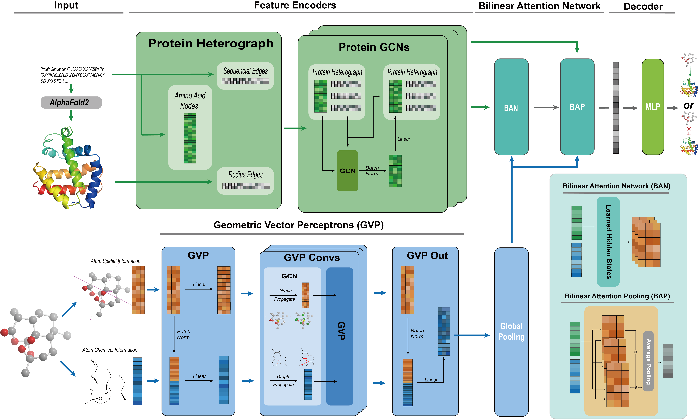

**SCOPE-DTI**: **S**emi-Inductive Dataset **C**onstruction and Framework **O**ptimization for **P**ractical Usability **E**nhancement in Deep Learning-Based **D**rug **T**arget **I**nteraction Prediction

## Introduction

This repository contains the PyTorch implementation of **SCOPE-DTI** framework, as described in our paper "[**SCOPE-DTI**: **S**emi-Inductive Dataset **C**onstruction and Framework **O**ptimization for **P**ractical Usability **E**nhancement in Deep Learning-Based **D**rug **T**arget **I**nteraction Prediction](https://example.com)". The SCOPE-DTI framework is a unified framework that integrates a large-scale, well-balanced semi-inductive human DTI dataset with advanced deep learning model. The **​SCOPE​ dataset** is publicly available and can be downloaded from https://awi.cuhk.edu.cn/SCOPE/. If you wish to use ​SCOPE-DTI​ for y**our own prediction tasks**, we recommend visiting [Lightweight-SCOPE-DTI-for-Inference](https://github.com/Yigang-Chen/Lightweight-SCOPE-DTI-for-Inference), a **lightweight version of ​SCOPE-DTI**​ that includes a well-prepared prediction pipeline for easier deployment.

## Framework


## Environment Requirement 

```bash
conda create --name scope python=3.9
conda activate scope

conda install pytorch==2.2.0 torchvision==0.17.0 torchaudio==2.2.0 pytorch-cuda=11.8 -c pytorch -c nvidia
conda install pyg=2.5.2 -c pyg
conda install -c dglteam/label/th22_cu118 dgl
conda install -c conda-forge rdkit==2024.03.5
conda install pyarrow
conda install tensorboard

pip install pyg_lib torch_scatter torch_sparse torch_cluster torch_spline_conv -f https://data.pyg.org/whl/torch-2.2.0+cu118.html
pip install dgllife==0.3.2
pip install yacs
pip install prettytable
# make sure numpy=1.x
```

We also recommended you to try micromamba to replace conda.

## Demo
We provide a running demo of ​SCOPE-DTI​ in the notebook file `SCOPE-DTI-demo.ipynb`. For this demo, we randomly selected 10 proteins along with their interaction data from the **​SCOPE Total**​ dataset, utilizing a semi-inductive split strategy.

You can use this demo to quickly understand the operational logic of ​SCOPE-DTI. On an NVIDIA 2080Ti GPU, the demo typically takes around ​25 minutes​ to run and consumes approximately ​4GB​ of VRAM.

## How to run

This model uses `yacs.config` module for configuration. The default values are in the `configs.py` file. You can check https://github.com/rbgirshick/yacs for using the configuration system.

The `main.py` and `dataloader.py` takes the first running argument as the path of the config file. To run under the default setting, this should be `config_yaml/default.yaml`, which is an empty file.

### Preprocessing (recommended)

#### Make sure `unip_cords.pkl` exists and configured in the config file

The protein coordination files are downloaded from Alphafold database. The download links are in the form of `https://alphafold.ebi.ac.uk/files/<UNIPROT_ID>-F1-model_v4.pdb` 

`unip_cords.pkl`: The protein 3D information used in this research. This file is a pandas DataFrame, containing String column `"sequence"` and `"crod"` column, which stores the residue coordination with shape`(L, 3)`, while `L` being the length of the protein sequence. The position of the file is referred as `PROTEIN.GRAPH.COORD_PATH	` in the configuration.

To run the model, you need to configure the requested parameters: 

| Configuration Item         | Description                                                  |
| -------------------------- | ------------------------------------------------------------ |
| `PROTEIN.GRAPH.COORD_PATH` | Path to the protein 3D information. pandas DataFrame containing String column `"sequence"` and `"crod"` column. |
| `PROTEIN.GRAPH.PATH`       | Path to store protein hetero graph information. This should be a `.pkl` file which would be generated by running `dataloader.py ` separately. |
| `DATA.TRAIN`               | Path to the training set file. Using `.parquet` is recommended. |
| `DATA.VAL`                 | Path to the validation set file. Using `.parquet` is recommended. |
| `DATA.TEST`                | Path to the test set file. Using `.parquet` is recommended.  |
| `SOLVER.SEED`              | The random seed used by the model.                           |
| `RESULT.OUTPUT_DIR`        | The output folder of the model result and training process.  |

#### Run `dataloader.py` to preprocess

After setting up the `PROTEIN.GRAPH.*` configurations, it is recommended to build the protein hetero graphs in advance. You can run `python dataloader.py config_yaml/<your settings>.yaml` to do the calculation and store the result at `PROTEIN.GRAPH.PATH` for further use.

### Run the model

After setting up all the requirements, you can run the model with `python main.py config_yaml/<your settings>.yaml`. 

>  It is legal to use `PARAM_NAME $param_value` to override the settings for easier scripting.

While running the model, you can use `tensorboard` to monitor the training process. The `logdir` should either set to be the project directory or the `RESULT.OUTPUT_DIR`.

The model's performance metrics would be stored at `RESULT.OUTPUT_DIR/metrics.json` when the test is completed.

 

