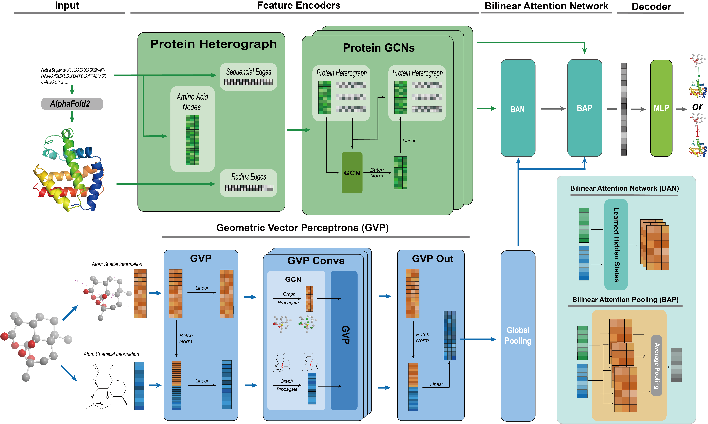

**SCOPE-DTI**: **S**emi-Inductive Dataset **C**onstruction and Framework **O**ptimization for **P**ractical Usability **E**nhancement in Deep Learning-Based **D**rug **T**arget **I**nteraction Prediction

## Introduction

> We also host a web interface that provides up to 20 minutes computation

This repository contains the PyTorch implementation of **SCOPE-DTI** framework, as described in our paper "[**SCOPE-DTI**: **S**emi-Inductive Dataset **C**onstruction and Framework **O**ptimization for **P**ractical Usability **E**nhancement in Deep Learning-Based **D**rug **T**arget **I**nteraction Prediction]([arXiv preview](https://arxiv.org/abs/2503.09251))".

The SCOPE-DTI framework is a unified framework that integrates a large-scale, well-balanced semi-inductive human DTI dataset with advanced deep learning model. **NEW**: SCOPE-DTI now supports **dual protein processing modes** - both 3D structure-based (graph) and 1D sequence-based (CNN) processing, allowing flexible adaptation to different data availability scenarios. A **web-based demo** of **SCOPE-DTI** (SCOPE-Web) is hosted at https://awi.cuhk.edu.cn/SCOPE, along with the publicly available **SCOPE dataset**, which can be downloaded from https://awi.cuhk.edu.cn/SCOPE/downloads.

If you wish to use SCOPE-DTI for your **own prediction tasks**, we recommend visiting [Lightweight-SCOPE-DTI-for-Inference](https://github.com/Yigang-Chen/Lightweight-SCOPE-DTI-for-Inference), a **lightweight version of SCOPE-DTI** that includes a well-prepared prediction pipeline for easier deployment.

Meanwhile, for a **ready-to-use deployment**, we provide a **Docker container**: https://hub.docker.com/r/zcorn/scope_web, which is the same as the SCOPE-Web stock version available at https://awi.cuhk.edu.cn/SCOPE/. This pre-configured environment allows experimental biologists to quickly set up and run **SCOPE-DTI** for inference.

## Framework


## Protein Processing Modes

SCOPE-DTI supports **two protein processing modes** to accommodate different data availability scenarios:

### 🧬 Graph Mode (Default)
- **Input**: 3D protein structure coordinates from AlphaFold
- **Processing**: Heterogeneous graph neural networks with spatial relationships
- **Best for**: High-accuracy prediction when 3D structures are available
- **Requirements**: Protein coordinate files (`unip_cords.pkl`)

### 🔤 Sequence Mode (New)
- **Input**: 1D protein amino acid sequences
- **Processing**: Convolutional Neural Networks (CNN)
- **Best for**: Fast processing when only sequences are available
- **Requirements**: Protein sequence data in DataFrame

### 🔄 Easy Mode Switching
Switch between modes by simply changing the configuration:

```bash
# Graph mode (default)
python main.py config_yaml/default.yaml

# Sequence mode
python main.py config_yaml/sequence.yaml
```

Both modes use the same training pipeline and produce comparable results, giving you flexibility to choose based on your data availability and computational requirements.

## Environment Requirement 

```bash
conda create --name scope python=3.9
conda activate scope

conda install pytorch==2.2.0 torchvision==0.17.0 torchaudio==2.2.0 pytorch-cuda=11.8 -c pytorch -c nvidia
conda install pyg=2.5.2 -c pyg
conda install -c dglteam/label/th22_cu118 dgl
conda install -c conda-forge rdkit==2024.03.5
conda install pyarrow
conda install tensorboard

pip install pyg_lib torch_scatter torch_sparse torch_cluster torch_spline_conv -f https://data.pyg.org/whl/torch-2.2.0+cu118.html
pip install dgllife==0.3.2
pip install yacs
pip install prettytable
# make sure numpy=1.x
```

We also recommended you to try micromamba to replace conda.

## Demo
We provide a comprehensive running demo of ​SCOPE-DTI​ in the notebook file `SCOPE-DTI-demo.ipynb`. For this demo, we randomly selected 10 proteins along with their interaction data from the **​SCOPE Total**​ dataset, utilizing a semi-inductive split strategy.

The demo includes:
- **Graph Mode Demo**: Traditional 3D structure-based processing
- **Sequence Mode Demo**: New 1D sequence-based processing  
- **Performance Comparison**: Side-by-side comparison of both modes
- **Usage Examples**: How to switch between modes and configure settings

You can use this demo to quickly understand the operational logic of both processing modes in ​SCOPE-DTI. On an NVIDIA 2080Ti GPU, the demo typically takes around ​25 minutes​ for graph mode and ​10-15 minutes​ for sequence mode, consuming approximately ​4GB​ of VRAM.

## How to run

This model uses `yacs.config` module for configuration. The default values are in the `configs.py` file. You can check https://github.com/rbgirshick/yacs for using the configuration system.

The `main.py` and `dataloader.py` takes the first running argument as the path of the config file. 

### 🚀 Quick Start

**Graph Mode (3D Structure-based)**:
```bash
python main.py config_yaml/default.yaml
```

**Sequence Mode (1D Sequence-based)**:
```bash
python main.py config_yaml/sequence.yaml
```

### ⚙️ Configuration

Choose your processing mode by setting `PROTEIN.MODE` in your configuration file:

**For Graph Mode (`config_yaml/default.yaml`)**:
```yaml
PROTEIN:
  MODE: "graph"  # Use 3D structure information
  GRAPH:
    COORD_PATH: "data/demo_unip_cords.pkl"
    # ... other graph-specific settings
```

**For Sequence Mode (`config_yaml/sequence.yaml`)**:
```yaml
PROTEIN:
  MODE: "sequence"  # Use sequence information
  EMBEDDING_DIM: 128
  SEQUENCE:
    CHAR_DIM: 128
    NUM_FILTERS: [128, 128, 128]
    KERNEL_SIZE: [3, 6, 9]
```

### 📋 Configuration Parameters

To run the model, you need to configure the requested parameters based on your chosen mode:

#### Core Configuration

| Configuration Item    | Description                                                  |
| --------------------- | ------------------------------------------------------------ |
| `PROTEIN.MODE`        | **Mode Selection**: `"graph"` for 3D structure mode, `"sequence"` for sequence mode |
| `DATA.TRAIN`          | Path to the training set file. Using `.parquet` is recommended. |
| `DATA.VAL`            | Path to the validation set file. Using `.parquet` is recommended. |
| `DATA.TEST`           | Path to the test set file. Using `.parquet` is recommended.  |
| `SOLVER.SEED`         | The random seed used by the model.                           |
| `RESULT.OUTPUT_DIR`   | The output folder of the model result and training process.  |

#### Graph Mode Specific Configuration

| Configuration Item         | Description                                                  |
| -------------------------- | ------------------------------------------------------------ |
| `PROTEIN.GRAPH.COORD_PATH` | Path to the protein 3D information. pandas DataFrame containing String column `"sequence"` and `"crod"` column. |
| `PROTEIN.GRAPH.PATH`       | Path to store protein hetero graph information. This should be a `.pkl` file which would be generated by running `dataloader.py` separately. |
| `PROTEIN.GRAPH.NUM_KNN`    | Number of nearest neighbors for KNN edges (default: 5)      |
| `PROTEIN.GRAPH.EDGE_CUTOFF`| Distance cutoff for spatial edges (default: 10 Å)          |

#### Sequence Mode Specific Configuration

| Configuration Item              | Description                                                  |
| ------------------------------- | ------------------------------------------------------------ |
| `PROTEIN.SEQUENCE.CHAR_DIM`     | Character embedding dimension (default: 128)                |
| `PROTEIN.SEQUENCE.NUM_FILTERS`  | CNN filter numbers for each layer (default: [128, 128, 128]) |
| `PROTEIN.SEQUENCE.KERNEL_SIZE`  | CNN kernel sizes for each layer (default: [3, 6, 9])       |

### Preprocessing

#### For Graph Mode (3D Structure-based)

Make sure `unip_cords.pkl` exists and is configured in the config file. The protein coordination files are downloaded from Alphafold database. The download links are in the form of `https://alphafold.ebi.ac.uk/files/<UNIPROT_ID>-F1-model_v4.pdb` 

`unip_cords.pkl`: The protein 3D information used in this research. This file is a pandas DataFrame, containing String column `"sequence"` and `"crod"` column, which stores the residue coordination with shape`(L, 3)`, while `L` being the length of the protein sequence.

#### For Sequence Mode (1D Sequence-based)

Ensure your dataset contains protein sequence information in a `sequence` or `target_sequence` column. No 3D structure files are required for this mode.

#### Run `dataloader.py` to preprocess (Graph Mode Only)

**For Graph Mode**: After setting up the `PROTEIN.GRAPH.*` configurations, it is recommended to build the protein hetero graphs in advance:

```bash
python dataloader.py config_yaml/default.yaml
```

This will calculate and store the result at `PROTEIN.GRAPH.PATH` for further use.

**For Sequence Mode**: No preprocessing required! The model will automatically process protein sequences during training.

### 🚀 Run the model

After setting up all the requirements, you can run the model:

**Graph Mode**:
```bash
python main.py config_yaml/default.yaml
```

**Sequence Mode**:
```bash
python main.py config_yaml/sequence.yaml
```

**Custom Configuration**:
```bash
python main.py config_yaml/your_custom_config.yaml
```

>  💡 **Pro Tip**: It is legal to use `PARAM_NAME $param_value` to override the settings for easier scripting.

### 📊 Monitoring and Results

While running the model, you can use `tensorboard` to monitor the training process. The `logdir` should either set to be the project directory or the `RESULT.OUTPUT_DIR`.

The model's performance metrics would be stored at `RESULT.OUTPUT_DIR/metrics.json` when the test is completed.

**Expected Performance**:
- **Graph Mode**: AUROC ~0.84 (high accuracy with 3D structure information)
- **Sequence Mode**: AUROC ~0.71 (good performance with sequence-only data)

### 🔧 Troubleshooting

**Common Issues**:

1. **Graph Mode Issues**: 
   - Ensure `unip_cords.pkl` exists and contains required protein coordinates
   - Run `python dataloader.py` for preprocessing first

2. **Sequence Mode Issues**: 
   - Check that your dataset contains `sequence` or `target_sequence` columns
   - Verify protein sequences contain valid amino acid characters

3. **Memory Issues**: 
   - Graph mode requires more memory; consider reducing batch size
   - Sequence mode is more memory-efficient for large datasets

 

